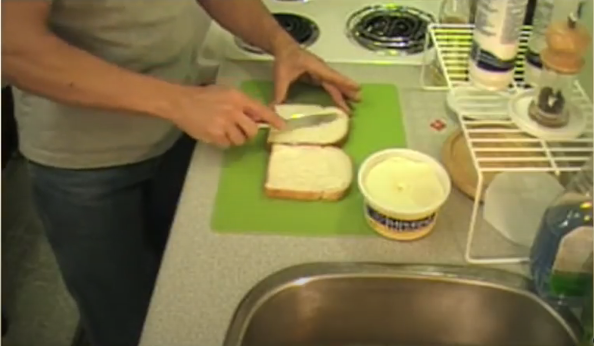

# Video-Retrieval-System
In this project we aim to implement a video retrieval system that, given a persian/english prompt, can find the frames that are contextually similar to the input prompt. For the purpose of this project we mainly focus on cooking videos. Firstly, we introduce the chosen dataset and explain the data preparation stage in detail with some examples, as the data is vital in our finetuning. Then, we shift our focus to the finetuning methods used to add the capability of understanding persian prompts. After that, we explain our evaluation method and share our results. Finally, we show how to setup the environment and run the project.

## **Table of Contents**
1. [Chosen Dataset](#Chosen-Dataset)
2. [Data Preparation](#Data-Preparation)
3. [Example Data](#Example-Data)
4. [Finetuning Methods Experimented](#finetune)
5. [Evaluation Method](#eval)
6. [Results](#result)
7. [Setup and Run Guide](#run)

## **Chosen Dataset**
The dataset that was chosen for this project is YouCook2 dataset. Some general information about the dataset is given below and directly extracted from the datasets's website which can be found [here](http://youcook2.eecs.umich.edu/).
The total video time for the dataset is 176 hours with an average length of 5.26 mins for each video. Each video captured is within 10 mins and is recorded by camera devices but not slideshows. All the videos and precomputed feature can be downloaded in the Download page.
Each video contains some number of procedure steps to fulfill a recipe. All the procedure segments are temporal localized in the video with starting time and ending time. The distributions of 1) video duration, 2) number of recipe steps per video, 3) recipe segment duration and 4) number of words per sentence are shown below
## **Data Preparation**
The main challenge in this project is to obtain persian-labled pictures. To overcome this issue, we wrote a script that uses an NMT to translate all the english captions of YouCook2 and adds it as a new field to output.json which holds some crucial information such as the youtube link of the video. The most important part of the code is **run_model_batch()** that reads the captions batch by batch and feeds it to our Transformer model and receives the translation of the captions.
```python
def run_model_batch(input_strings, batch_size=128,max_new_tokens=50,initial_index=0, **generator_args):
    translations = []
    counter=initial_index
    start=tic()
    elapsed_time=0
    #trans_check=initial_index
    for i in range(initial_index, len(input_strings), batch_size):
        batch = input_strings[i:i + batch_size]
        inputs = tokenizer(batch, return_tensors="pt", padding=True, truncation=True)
        # Move input tensors to GPU
        input_ids = inputs['input_ids'].to(device)
        attention_mask = inputs['attention_mask'].to(device)

        res = model.generate(input_ids, attention_mask=attention_mask,max_new_tokens=max_new_tokens, **generator_args)
        outputs = tokenizer.batch_decode(res, skip_special_tokens=True)
        translations.extend(outputs)
        if(toc(start)>=60):
          elapsed_time+=toc(start)
          print(f"Number of sentences translated : {len(translations)} , Elapsed time : {elapsed_time} seconds")
          start=tic()
    return translations
```
The last thing that code does is to update our json and write all the translations to the json file.
## **Example Data**
The [first video](https://www.youtube.com/watch?v=GLd3aX16zBg) in our dataset is a special Grilled Cheese Recipe.The json file of the video something like this :
```json
{"GLd3aX16zBg": {"duration": 241.62, "subset": "training", "recipe_type": "113", "annotations": [{"segment": [90, 102], "id": 0, "sentence": "spread margarine on two slices of white bread"}, {"segment": [114, 127], "id": 1, "sentence": "place a slice of cheese on the bread"}, {"segment": [132, 138], "id": 2, "sentence": "place the bread slices on top of each other and place in a hot pan"}, {"segment": [139, 145], "id": 3, "sentence": "flip the sandwich over and press down"}, {"segment": [173, 174], "id": 4, "sentence": "cut the sandwich in half diagonally"}, "video_url": "https://www.youtube.com/watch?v=GLd3aX16zBg"}
```
For instance, someone is spreading some margarine on two slices of bread from the 90th frame up until 102th. The caption is **spread margarine on two slices of white bread**.


*Figure 1: a sample frame from the video chosen from 90-102 interval*

The output json file looks something like this :
```json
{"GLd3aX16zBg": {"duration": 241.62, "subset": "training", "recipe_type": "113", "annotations": [{"segment": [90, 102], "id": 0, "sentence": "spread margarine on two slices of white bread", "translation": "\u0645\u0627\u0631\u06af\u0627\u0631\u06cc\u0646 \u0631\u0627 \u0631\u0648\u06cc \u062f\u0648 \u062a\u06a9\u0647 \u0646\u0627\u0646 \u0633\u0641\u06cc\u062f \u067e\u0647\u0646 \u06a9\u0646\u06cc\u062f"}, {"segment": [114, 127], "id": 1, "sentence": "place a slice of cheese on the bread", "translation": "\u06cc\u06a9 \u062a\u06a9\u0647 \u067e\u0646\u06cc\u0631 \u0631\u0648\u06cc \u0646\u0627\u0646 \u0628\u06af\u0630\u0627\u0631"}, {"segment": [132, 138], "id": 2, "sentence": "place the bread slices on top of each other and place in a hot pan", "translation": "\u062a\u06a9\u0647 \u0647\u0627\u06cc \u0646\u0627\u0646 \u0631\u0627 \u0631\u0648\u06cc \u0647\u0645 \u0642\u0631\u0627\u0631 \u062f\u0647\u06cc\u062f \u0648 \u062f\u0631 \u0645\u0627\u0647\u06cc\u062a\u0627\u0628\u0647 \u062f\u0627\u063a \u0642\u0631\u0627\u0631 \u062f\u0647\u06cc\u062f."}, {"segment": [139, 145], "id": 3, "sentence": "flip the sandwich over and press down", "translation": "\u0633\u0627\u0646\u062f\u0648\u06cc\u0686 \u0631\u0627 \u0628\u0647 \u0637\u0631\u0641 \u067e\u0627\u06cc\u06cc\u0646 \u067e\u0631\u062a \u06a9\u0646 \u0648 \u0641\u0634\u0627\u0631\u0634 \u0628\u062f\u0647"}, {"segment": [173, 174], "id": 4, "sentence": "cut the sandwich in half diagonally", "translation": "\u0633\u0627\u0646\u062f\u0648\u06cc\u0686 \u0631\u0627 \u0628\u0647 \u0637\u0648\u0631 \u0645\u0648\u0631\u0628 \u0646\u0635\u0641 \u06a9\u0646\u06cc\u062f"}], "video_url": "https://www.youtube.com/watch?v=GLd3aX16zBg"}
```
All the characters that start with \u are persian unicode characters that we will use to finetune our VLM model.
Here you can see the translation of some sample captions:
```yaml
captions:
  - caption1: 
      en: "Spread margarine on two slices of white bread."
      fa: "مارگارین را روی دو تکه نان سفید پهن کنید"
  - caption2:
      en: "Place the bread slices on top of each other and place in a hot pan."
      fa: "تکه های نان را روی هم قرار دهید و در ماهیتابه داغ قرار دهید"
  - caption3:
      en: "Cut the sandwich in half diagonally."
      fa: "ساندویچ را به طور مورب نصف کنید"
```
## **Finetuning Methods Experimented**
## **Evaluation Method**
## **Results**
## **Setup and Run Guide**


